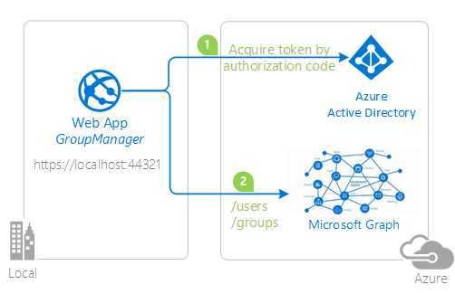
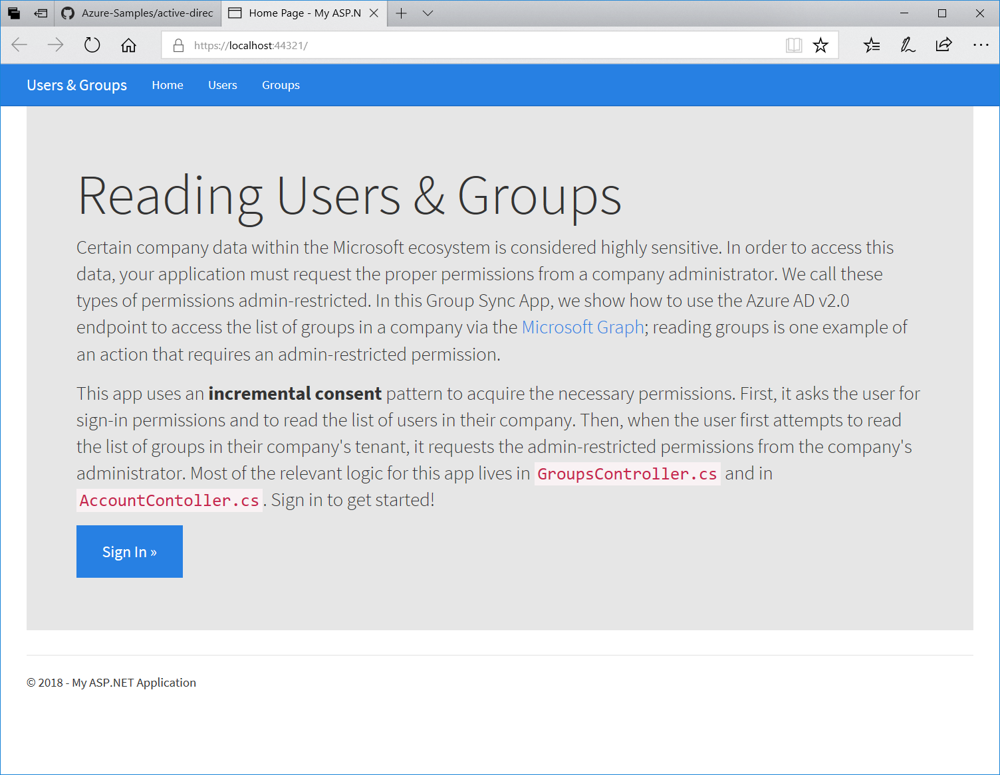
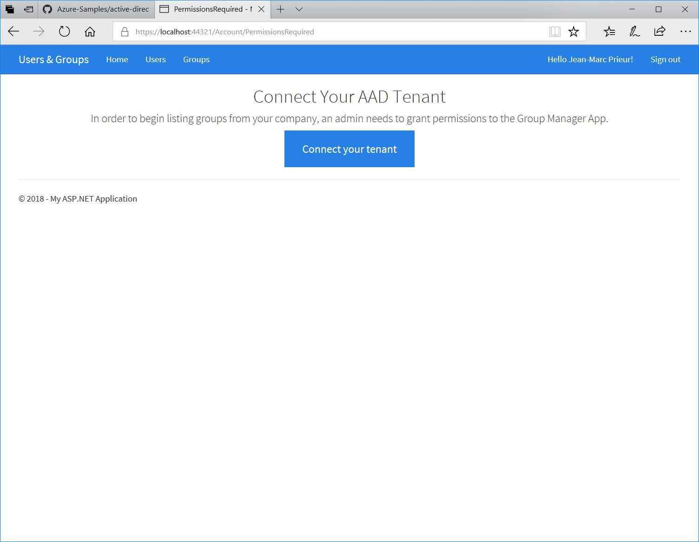

# Build an app with admin restricted scopes using the Microsoft identity platform endpoint


## About this sample

### Overview

Certain actions in the Azure Active Directory tenant are considered highly sensitive, such as deleting a user from the tenant, creating and managing applications, listing and assigning users to security groups.  Yet there are many valid reasons why applications need to perform these actions for their customers.  For this reason, some permissions are considered [admin restricted](https://docs.microsoft.com/en-us/azure/active-directory/develop/v2-permissions-and-consent#permission-types), and require a tenant administrator to approve their use in applications.  
This sample application shows how to use the [Microsoft identity platform endpoint](http://aka.ms/aadv2) to access data in the [Microsoft Graph](https://graph.microsoft.io) that requires [consent](https://docs.microsoft.com/en-us/azure/active-directory/develop/application-consent-experience) for permissions that have an administrative scope.



### Scenario

The app is built as an ASP.NET 4.5 MVC application, using the OWIN OpenID Connect middleware to sign-in users and uses the  [Microsoft Authentication Library (MSAL)](https://github.com/AzureAD/microsoft-authentication-library-for-dotnet)] to perform token acquisition.  It uses an [incremental consent](https://docs.microsoft.com/en-us/azure/active-directory/develop/azure-ad-endpoint-comparison#incremental-and-dynamic-consent) pattern, in which it first requests consent for a basic set of permission that an ordinary user can consent to themselves; like the ability to read a list of users in the user's organization.
Then, when the user tries to read a list of groups in the user's organization, it will ask the administrator for the necessary admin restricted permission.  In this way, any Microsoft business user can sign up for the application without contacting their tenant administrator, and the tenant administrator is only involved when absolutely necessary.



For more information on the concepts used in this sample, be sure to read the [Permissions and consent in the Microsoft identity platform endpoint](https://docs.microsoft.com/azure/active-directory/develop/v2-permissions-and-consent).

- Developers who wish to gain good familiarity of programming for Microsoft Graph are advised to go through the [An introduction to Microsoft Graph for developers](https://www.youtube.com/watch?v=EBbnpFdB92A) recorded session.

> Looking for previous versions of this code sample? Check out the tags on the [releases](../../releases) GitHub page.

## How to run this sample

To run this sample, you'll need:

- [Visual Studio 2017](https://aka.ms/vsdownload)
- An Internet connection
- An Azure Active Directory (Azure AD) tenant. For more information on how to get an Azure AD tenant, see [How to get an Azure AD tenant](https://azure.microsoft.com/en-us/documentation/articles/active-directory-howto-tenant/)
- A user account in your Azure AD tenant. This sample will not work with a Microsoft account (formerly Windows Live account). Therefore, if you signed in to the [Azure portal](https://portal.azure.com) with a Microsoft account and have never created a user account in your directory before, you need to do that now. You need to have at least one account which is a directory administrator to test the features which require an administrator to consent.

### Step 1:  Clone or download this repository

From your shell or command line:

```Shell
git clone https://github.com/Azure-Samples/active-directory-dotnet-admin-restricted-scopes-v2.git
```

or download and extract the repository .zip file.

> Given that the name of the sample is pretty long, and so are the name of the referenced NuGet packages, you might want to clone it in a folder close to the root of your hard drive, to avoid file size limitations on Windows.

### Step 2:  Register the sample application with your Azure Active Directory tenant

There is one project in this sample. To register it, you can:

- either follow the steps [Step 2: Register the sample with your Azure Active Directory tenant](#step-2-register-the-sample-with-your-azure-active-directory-tenant) and [Step 3:  Configure the sample to use your Azure AD tenant](#choose-the-azure-ad-tenant-where-you-want-to-create-your-applications)
- or use PowerShell scripts that:
  - **automatically** creates the Azure AD applications and related objects (passwords, permissions, dependencies) for you
  - modify the Visual Studio projects' configuration files.

If you want to use this automation:

1. On Windows, run PowerShell and navigate to the root of the cloned directory
1. In PowerShell run:

   ```PowerShell
   Set-ExecutionPolicy -ExecutionPolicy RemoteSigned -Scope Process -Force
   ```

1. Run the script to create your Azure AD application and configure the code of the sample application accordingly.
1. In PowerShell run:

   ```PowerShell
   .\AppCreationScripts\Configure.ps1
   ```

   > Other ways of running the scripts are described in [App Creation Scripts](./AppCreationScripts/AppCreationScripts.md)

1. Open the Visual Studio solution and click start to run the code.

If you don't want to use this automation, follow the steps below.

#### Choose the Azure AD tenant where you want to create your applications

As a first step you'll need to:

1. Sign in to the [Azure portal](https://portal.azure.com) using either a work or school account or a personal Microsoft account.
1. If your account is present in more than one Azure AD tenant, select your profile at the top right corner in the menu on top of the page, and then **switch directory**.
   Change your portal session to the desired Azure AD tenant.

#### Register the service app (restricted-scopes-v2)

1. Navigate to the Microsoft identity platform for developers [App registrations](https://go.microsoft.com/fwlink/?linkid=2083908) page.
1. Select **New registration**.
1. When the **Register an application page** appears, enter your application's registration information:
   - In the **Name** section, enter a meaningful application name that will be displayed to users of the app, for example `restricted-scopes-v2`.
   - Change **Supported account types** to **Accounts in any organizational directory**.
     > Note that there are more than one redirect URIs. You'll need to add them from the **Authentication** tab later after the app has been created successfully.
1. Select **Register** to create the application.
1. On the app **Overview** page, find the **Application (client) ID** value and record it for later. You'll need it to configure the Visual Studio configuration file for this project.
1. From the app's Overview page, select the **Authentication** section.
   - In the Redirect URIs section, select **Web** in the combo-box and enter the following redirect URIs.
       - `https://localhost:44321/`
       - `https://localhost:44321/Account/AADTenantConnected`
   - In the **Advanced settings** section set **Logout URL** to `https://localhost:44321/Account/EndSession`
   - In the **Advanced settings** | **Implicit grant** section, check **ID tokens** as this sample requires
     the [Implicit grant flow](https://docs.microsoft.com/en-us/azure/active-directory/develop/v2-oauth2-implicit-grant-flow) to be enabled to
     sign-in the user, and call an API.
1. Select **Save**.
1. From the **Certificates & secrets** page, in the **Client secrets** section, choose **New client secret**:

   - Type a key description (of instance `app secret`),
   - Select a key duration of either **In 1 year**, **In 2 years**, or **Never Expires**.
   - When you press the **Add** button, the key value will be displayed, copy, and save the value in a safe location.
   - You'll need this key later to configure the project in Visual Studio. This key value will not be displayed again, nor retrievable by any other means,
     so record it as soon as it is visible from the Azure portal.
1. Select the **API permissions** section
   - Click the **Add a permission** button and then,
   - Ensure that the **Microsoft APIs** tab is selected
   - In the *Commonly used Microsoft APIs* section, click on **Microsoft Graph**
   - In the **Delegated permissions** section, ensure that the right permissions are checked: **openid**, **email**, **profile**, **offline_access**, **User.Read**, **Group.Read.All**, **User.ReadBasic.All**. Use the search box if necessary.
   - Select the **Add permissions** button

### Step 3:  Configure the sample to use your Azure AD tenant

In the steps below, "ClientID" is the same as "Application ID" or "AppId".

Open the solution in Visual Studio to configure the projects

#### Configure the service project

> Note: if you used the setup scripts, the changes below will have been applied for you

1. Open the `GroupManager\Web.Config` file
1. Find the app key `ida:ClientId` and replace the existing value with the application ID (clientId) of the `restricted-scopes-v2` application copied from the Azure portal.
1. Find the app key `ida:ClientSecret` and replace the existing value with the key you saved during the creation of the `restricted-scopes-v2` app, in the Azure portal.
1. Find the app key `ida:Domain` and replace the existing value with your Azure AD tenant name.
1. Find the app key `ida:TenantId` and replace the existing value with your Azure AD tenant ID.
1. Find the app key `ida:PostLogoutRedirectUri` and replace the existing value with the base address of the restricted-scopes-v2 project (by default `https://localhost:44321/`).

### Step 4: Run the sample

Start the GroupManager application, and begin by signing in as an administrator in your Azure AD tenant.  If you don't have an Azure AD tenant for testing, you can [follow these instructions](https://azure.microsoft.com/documentation/articles/active-directory-howto-tenant/) to get one.

When you sign in, the app will first ask you for permission to sign you in, read your user profile, and read a list of users in your tenant.  Any user in your tenant will be able to consent to these permissions.  The application will then show a list of users from your Azure AD tenant via the Microsoft Graph, on the **Users** page.

Then, navigate to the **Groups** page.  The app will try to query the Microsoft Graph for a list of groups in your tenant. If it is unable to do so, it will ask you (the tenant administrator) to connect your tenant to the application, providing permission to read groups in your tenant.  Only administrators in your tenant will be able to consent to this permission.  Once administrative consent is acquired, no other users in the tenant will be asked to consent to the app going forward.



> Did the sample not work for you as expected? Did you encounter issues trying this sample? Then please reach out to us using the [GitHub Issues](../../issues) page.

## About the code

The relevant code for this sample is in the following files:

### Sign In

As it is standard practice for ASP.NET MVC apps, the sign-in functionality is implemented with the OpenID Connect OWIN middleware. Here there's a relevant snippet from the middleware initialization:

```csharp
app.UseOpenIdConnectAuthentication(
     new OpenIdConnectAuthenticationOptions
     {
          Authority = Globals.Authority,
          ClientId = Globals.ClientId,
          RedirectUri = Globals.RedirectUri,
          PostLogoutRedirectUri = Globals.RedirectUri,
          Scope = Globals.BasicSignInScopes, // a basic set of permissions for user sign in & profile access
          TokenValidationParameters = new TokenValidationParameters
          {
               // In a real application you would use ValidateIssuer = true for additional checks and security.
               ValidateIssuer = false,
               NameClaimType = "name",
          },
          Notifications = new OpenIdConnectAuthenticationNotifications()
          {
               SecurityTokenValidated = OnSecurityTokenValidated,
               AuthorizationCodeReceived = OnAuthorizationCodeReceived,
               AuthenticationFailed = OnAuthenticationFailed,
          }
     });
```

Important things to notice:

- The list of scopes includes both entries that are used for the sign-in function (`openid profile email`) and for the token acquisition function (`offline_access`  is required to obtain refresh_tokens).
- The application then acquires an [access_token](https://docs.microsoft.com/en-us/azure/active-directory/develop/access-tokens) for [Microsoft Graph](https://graph.microsoft.com), with the permission (scope) [user.readbasic.all](https://docs.microsoft.com/en-us/graph/permissions-reference). An access token with this scope can read all users' basic profiles in a tenant. We will use this access token on `/Users/Index` page to list all the users on the organization.
- In this sample, the issuer validation is turned off, which means that anybody with an account can access the application. Real life applications would likely be more restrictive, limiting access only to those Azure AD tenants or Microsoft accounts associated to customers of the application itself. In other words, real life applications would likely also have a sign-up function - and the sign-in would enforce that only the users who previously signed up have access. For simplicity, this sample does not include sign up features.

### Initial token acquisition

This sample makes use of OpenId Connect hybrid flow, where at authentication time the app receives both sign in info, the  [id_token](https://docs.microsoft.com/en-us/azure/active-directory/develop/id-tokens)  and artifacts (in this case, an  [authorization code](https://docs.microsoft.com/en-us/azure/active-directory/develop/v2-oauth2-auth-code-flow)) that the app can use for obtaining an [access token](https://docs.microsoft.com/en-us/azure/active-directory/develop/access-tokens). That token can be used to access other resources - in this sample, the Microsoft Graph, for the purpose of getting all the users in the organization.

This sample shows how to use MSAL to redeem the authorization code into an access token, which is saved in a cache along with any other useful artifact (such as associated  [refresh_tokens](https://docs.microsoft.com/en-us/azure/active-directory/develop/v2-oauth2-auth-code-flow#refresh-the-access-token)) so that it can be used later on in the application from the controllers' actions to fetch access tokens after they are expired.

The redemption takes place in the  `AuthorizationCodeReceived`  notification of the authorization middleware. Here there's the relevant code:

```csharp
private async Task OnAuthorizationCodeReceived(AuthorizationCodeReceivedNotification context)
{
     IConfidentialClientApplication confidentialClient = MsalAppBuilder.BuildConfidentialClientApplication(new ClaimsPrincipal(context.AuthenticationTicket.Identity));

     AuthenticationResult result = await confidentialClient.AcquireTokenByAuthorizationCode(new[] { "user.readbasic.all" }, context.Code).ExecuteAsync();
}
```

Important things to notice:

- The  `IConfidentialClientApplication`  is the primitive that MSAL uses to model the Web application. As such, it is initialized with the main application's coordinates.
- The scope requested by  `AcquireTokenByAuthorizationCode`  is just the one required for invoking the API targeted by the application as part of its essential features. We'll see later that the app allows for extra scopes, but you can ignore those at this point.
- The instance of `IConfidentialClientApplication` is created and attached to an instance of `MSALPerUserMemoryTokenCache`, which is a custom cache implementation that uses a shared instance of a [MemoryCache](https://docs.microsoft.com/en-us/dotnet/api/system.runtime.caching.memorycache?view=netframework-4.8) to cache tokens. When it acquires the access token, MSAL also saves this token in its token cache. When any code in the rest of the project tries to acquire an access token for Microsoft Graph with the same scope (user.readbasic.all), MSAL will return the cached token.

- In the code, the `IConfidentialClientApplication` is created in a function in the `MsalAppBuilder` class.

```csharp
public static IConfidentialClientApplication BuildConfidentialClientApplication(ClaimsPrincipal currentUser)
{
     IConfidentialClientApplication clientapp = ConfidentialClientApplicationBuilder.Create(Globals.ClientId)
               .WithClientSecret(Globals.ClientSecret)
               .WithRedirectUri(Globals.RedirectUri)
               .WithAuthority(new Uri(Globals.Authority))
               .Build();

     // After the ConfidentialClientApplication is created, we overwrite its default UserTokenCache with our implementation
     MSALPerUserMemoryTokenCache userTokenCache = new MSALPerUserMemoryTokenCache(clientapp.UserTokenCache, currentUser ?? ClaimsPrincipal.Current);
     return clientapp;
}
```

Important things to notice:

- The method builds an instance of the IConfidentialClientApplication using the new  [builder pattern introduced by MSAL v3.X](https://github.com/AzureAD/microsoft-authentication-library-for-dotnet/wiki/Client-Applications).
- `MSALPerUserMemoryTokenCache`  is a sample implementation of a custom MSAL token cache, which saves tokens in a  [MemoryCache](https://docs.microsoft.com/en-us/dotnet/framework/performance/caching-in-net-framework-applications)  instance shared across the web app. In a real-life application, you would likely want to save tokens in a long lived store instead, so that you don't need to retrieve new ones more often than necessary.

### Consuming Graph API

This sample consumes the graph api in two places: `UsersController.cs` and `GroupsController.cs`. To consume Graph, we need to have a token with the scopes required by the API then call the endpoint attaching this token on the request header as `Bearer`. 

See details about [bearer token](https://tools.ietf.org/html/rfc6750). Lets see the `UsersController.cs` example first:

```csharp
try
{
     // Get a token for the Microsoft Graph
     string token = await GetGraphAccessToken(userId);

     // Construct the query
     HttpClient client = new HttpClient();
     HttpRequestMessage request = new HttpRequestMessage(HttpMethod.Get, Globals.MicrosoftGraphUsersApi);
     request.Headers.Authorization = new System.Net.Http.Headers.AuthenticationHeaderValue("Bearer", token);

     // Ensure a successful response
     HttpResponseMessage response = await client.SendAsync(request);
     response.EnsureSuccessStatusCode();

     // Populate the data store with the first page of groups
     string json = await response.Content.ReadAsStringAsync();
     UserResponse result = JsonConvert.DeserializeObject<UserResponse>(json);
     userList[tenantId] = result.value;
}
catch (MsalUiRequiredException ex)
{
     return new RedirectResult("/Account/SignIn");
}
```

```csharp
private async Task<string> GetGraphAccessToken()
{
     IConfidentialClientApplication cc = MsalAppBuilder.BuildConfidentialClientApplication();
     var userAccount = await cc.GetAccountAsync(ClaimsPrincipal.Current.GetMsalAccountId());

     AuthenticationResult result = await cc.AcquireTokenSilent(new string[] { "user.readbasic.all" }, userAccount).ExecuteAsync();
     return result.AccessToken;
}
```

Important things to notice:

- Since we asked the scope `user.readbasic.all` on the sign in process, we have it cached already and the token is valid to consume the Graph API `https://graph.microsoft.com/v1.0/users`. So no additional consent is required in this case.
- If the access token is expired MSAL will first attempt to get a fresh access token using the cached refresh token. If the refresh token itself is expired or the token cache is empty for the current user, the `MsalUiRequiredException` is thrown, and we redirect the user to the sign in page. 
- In this particular sample, we are persisting the cache in memory just for simplicity, but this results in a problem. If you restart the application, the cache will be wiped out but the user will still be logged in by ASP.NET using their cookies. If we try to get a token for that user, a `MsalUiRequiredException` will be thrown and they will have to sign in again. This is done to re populate the cache. In a real-life application, you would likely want to save tokens in a long lived store instead.

### Requesting additional consent

Another place that we are consuming Graph API is on `GroupsController.cs`. Differently from the `UsersController.cs` example, the scope required here is `group.read.all` which is not included in the access token we obtained and cached during the sign in process.
When the `GetGraphAccessToken` tries to get an access token with this scope from MSAL, MSAL does not find it in the cache. It throws a `MsalUiRequiredException` and we have to get the user back to the sign in screen and obtain an access token for the scope.

```csharp
try
{
    // Get a token for our admin-restricted set of scopes Microsoft Graph
    string token = await GetGraphAccessToken(new string[] { "group.read.all" });

    // Construct the groups query
    HttpClient client = new HttpClient();
    HttpRequestMessage request = new HttpRequestMessage(HttpMethod.Get, Globals.MicrosoftGraphGroupsApi);
    request.Headers.Authorization = new System.Net.Http.Headers.AuthenticationHeaderValue("Bearer", token);

    // Ensure a successful response
    HttpResponseMessage response = await client.SendAsync(request);
    response.EnsureSuccessStatusCode();

    // Populate the data store with the first page of groups
    string json = await response.Content.ReadAsStringAsync();
    GroupResponse result = JsonConvert.DeserializeObject<GroupResponse>(json);
    groupList[tenantId] = result.value;
}

catch (MsalUiRequiredException ex)
{
    if (ex.ErrorCode == "user_null")
    {
        return new RedirectResult("/Account/SignIn/?redirectUrl=/Groups");
    }

    else if (ex.ErrorCode == "invalid_grant")
    {
        // If we got a token for the basic scopes, but not the admin-restricted scopes,
        // then we need to ask the admin to grant permissions by by connecting their tenant.
        return new RedirectResult("/Account/PermissionsRequired");
    }
    else
        return new RedirectResult("/Error?message=" + ex.Message);

}
// Handle unexpected errors.
catch (Exception ex)
{
    return new RedirectResult("/Error?message=" + ex.Message);
}
```

```csharp
private async Task<string> GetGraphAccessToken(string[] scopes)
{
    IConfidentialClientApplication cc = MsalAppBuilder.BuildConfidentialClientApplication();
    IAccount userAccount = await cc.GetAccountAsync(ClaimsPrincipal.Current.GetMsalAccountId());

    AuthenticationResult result = await cc.AcquireTokenSilent(scopes, userAccount).ExecuteAsync();
    return result.AccessToken;
}
```

Important things to notice:

- We are requesting an Access Token with the scope `group.read.all`. To get this token we call [AcquireTokenSilent](https://docs.microsoft.com/en-us/dotnet/api/microsoft.identity.client.clientapplicationbase.acquiretokensilent?view=azure-dotnet) method, which attempts to acquire it from the user token cache first avoiding extra call to the Identity Provider.
- `group.read.all` requires a tenant admin to grant consent. So we redirect the user to the admin consent [endpoint](https://docs.microsoft.com/en-us/azure/active-directory/develop/v2-permissions-and-consent#using-the-admin-consent-endpoint) where the tenant admin will be able to grant consent for this scope.

## How to deploy this sample to Azure

This project has one WebApp / Web API projects. To deploy them to Azure Web Sites, you'll need, for each one, to:

- create an Azure Web Site
- publish the Web App / Web APIs to the web site, and
- update its client(s) to call the web site instead of IIS Express.

### Create and publish the `restricted-scopes-v2` to an Azure Web Site

1. Sign in to the [Azure portal](https://portal.azure.com).
1. Click `Create a resource` in the top left-hand corner, select **Web** --> **Web App**, and give your web site a name, for example, `restricted-scopes-v2-contoso.azurewebsites.net`.
1. Thereafter select the `Subscription`, `Resource Group`, `App service plan and Location`. `OS` will be **Windows** and `Publish` will be **Code**.
1. Click `Create` and wait for the App Service to be created.
1. Once you get the `Deployment succeeded` notification, then click on `Go to resource` to navigate to the newly created App service.
1. Once the web site is created, locate it it in the **Dashboard** and click it to open **App Services** **Overview** screen.
1. From the **Overview** tab of the App Service, download the publish profile by clicking the **Get publish profile** link and save it.  Other deployment mechanisms, such as from source control, can also be used.
1. Switch to Visual Studio and go to the restricted-scopes-v2 project.  Right click on the project in the Solution Explorer and select **Publish**.  Click **Import Profile** on the bottom bar, and import the publish profile that you downloaded earlier.
1. Click on **Configure** and in the `Connection tab`, update the Destination URL so that it is a `https` in the home page url, for example [https://restricted-scopes-v2-contoso.azurewebsites.net](https://restricted-scopes-v2-contoso.azurewebsites.net). Click **Next**.
1. On the Settings tab, make sure `Enable Organizational Authentication` is NOT selected.  Click **Save**. Click on **Publish** on the main screen.
1. Visual Studio will publish the project and automatically open a browser to the URL of the project.  If you see the default web page of the project, the publication was successful.

### Update the Active Directory tenant application registration for `restricted-scopes-v2`

1. Navigate back to to the [Azure portal](https://portal.azure.com).
In the left-hand navigation pane, select the **Azure Active Directory** service, and then select **App registrations**.
1. In the resultant screen, select the `restricted-scopes-v2` application.
1. In the **Authentication** | page for your application, update the Logout URL fields with the address of your service, for example [https://restricted-scopes-v2-contoso.azurewebsites.net](https://restricted-scopes-v2-contoso.azurewebsites.net)
1. From the *Branding* menu, update the **Home page URL**, to the address of your service, for example [https://restricted-scopes-v2-contoso.azurewebsites.net](https://restricted-scopes-v2-contoso.azurewebsites.net). Save the configuration.
1. Add the same URL in the list of values of the *Authentication -> Redirect URIs* menu. If you have multiple redirect urls, make sure that there a new entry using the App service's Uri for each redirect url.

## Community Help and Support

Use [Stack Overflow](http://stackoverflow.com/questions/tagged/msal) to get support from the community.
Ask your questions on Stack Overflow first and browse existing issues to see if someone has asked your question before.
Make sure that your questions or comments are tagged with [`adal` `msal` `dotnet`].

If you find a bug in the sample, please raise the issue on [GitHub Issues](../../issues).

To provide a recommendation, visit the following [User Voice page](https://feedback.azure.com/forums/169401-azure-active-directory).

## Contributing

If you'd like to contribute to this sample, see [CONTRIBUTING.MD](/CONTRIBUTING.md).

This project has adopted the [Microsoft Open Source Code of Conduct](https://opensource.microsoft.com/codeofconduct/). For more information, see the [Code of Conduct FAQ](https://opensource.microsoft.com/codeofconduct/faq/) or contact [opencode@microsoft.com](mailto:opencode@microsoft.com) with any additional questions or comments.

## More information

- [Microsoft identity platform](https://docs.microsoft.com/en-us/azure/active-directory/develop/)
- [Quickstart: Register an application with the Microsoft identity platform](https://docs.microsoft.com/azure/active-directory/develop/quickstart-register-app)
- [Quickstart: Configure a client application to access web APIs](https://docs.microsoft.com/azure/active-directory/develop/quickstart-configure-app-access-web-apis)

- [Understanding Azure AD application consent experiences](https://docs.microsoft.com/en-us/azure/active-directory/develop/application-consent-experience)
- [Understand user and admin consent](https://docs.microsoft.com/en-us/azure/active-directory/develop/howto-convert-app-to-be-multi-tenant#understand-user-and-admin-consent)
- [Application and service principal objects in Azure Active Directory](https://docs.microsoft.com/en-us/azure/active-directory/develop/app-objects-and-service-principals)

- [MSAL.NET's conceptual documentation](https://aka.ms/msal-net)
- [Customizing Token cache serialization](https://aka.ms/msal-net-token-cache-serialization)
- [Types of Applications](https://aka.ms/msal-net-client-applications)
- [Acquiring Tokens](https://aka.ms/msal-net-acquiring-tokens)

- [National Clouds](https://docs.microsoft.com/en-us/azure/active-directory/develop/authentication-national-cloud#app-registration-endpoints)

For more information about how OAuth 2.0 protocols work in this scenario and other scenarios, see [Authentication Scenarios for Azure AD](http://go.microsoft.com/fwlink/?LinkId=394414).
